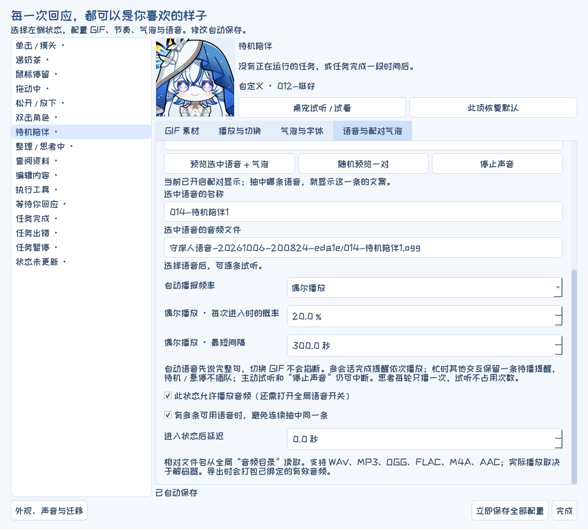
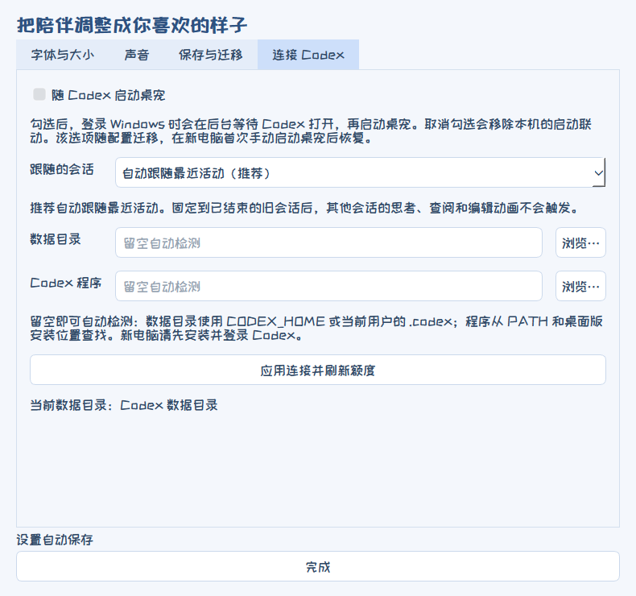

<!-- README language switch -->
[](README.md) [](README.en.md)
<!-- /README language switch -->

<div align="center">

# Shorekeeper Codex Desktop Pet

**A desktop companion that changes expressions with your Codex tasks, with customizable GIFs, voices, and speech bubbles.**

[Download for Windows](https://github.com/Doya16/shorekeeper-codex-pet/releases/latest) · [Watch the demo](https://github.com/Doya16/shorekeeper-codex-pet/releases/download/v0.8.1/shorekeeper-landscape.mp4) · [User guide (Chinese)](docs/USAGE.md) · [Report an issue](https://github.com/Doya16/shorekeeper-codex-pet/issues)


</div>

For **Windows 10/11 x64**. The complete package includes three expression packs with 83 GIFs, plus 40 audio files, matching lines, and fonts. Expression bindings, playback timing, bubbles, voices, and appearance are preset. Extract the package and run it; no Python installation is required.

## Preview


[Landscape video: interactions and the full settings walkthrough](https://github.com/Doya16/shorekeeper-codex-pet/releases/download/v0.8.1/shorekeeper-landscape.mp4) · [Portrait video](https://github.com/Doya16/shorekeeper-codex-pet/releases/download/v0.8.1/shorekeeper-portrait.mp4)

Tasks and quota values shown are demonstration examples.

## Download and get started

The application uses Chinese interface labels. This guide keeps those labels alongside their English meanings so you can find the matching controls.

1. Install **Codex** on Windows and sign in.
2. Open [Releases](https://github.com/Doya16/shorekeeper-codex-pet/releases/latest) and download **Shorekeeper-Windows-v0.9.1.zip**.
3. Extract the entire archive and run **守岸人Codex桌宠启动.exe**. Keep the other folders alongside the executable.
4. Right-click the pet → **自动跟随当前任务** (automatically follow the current task). Open **交互工作室** (Interaction Studio) to change expressions and voices.

Sound is enabled by default at 10% volume. Adjust or disable it under **外观、声音与迁移 → 声音** (Appearance, Sound & Migration → Sound).

## Features

- **Task following:** switch expressions when Codex is thinking, reading, editing, waiting, or finished. When multiple projects run at once, completion notifications play in sequence before returning to the active task.
- **Mouse interactions:** configure separate responses for a single-click head pat, double-click, dragging, dropping, and offering milk tea.
- **Custom assets:** choose a GIF or image for each interaction and adjust looping, speed, hold time, and the next state.
- **Voices and lines:** add multiple voice clips to one action, pair each with bubble text, and play a randomly selected pair.
- **Appearance and quota:** resize in real time, change fonts and font sizes, and show usage quota below the pet.
- **Save and migrate:** package GIFs, audio, bubble text, fonts, and all settings for another computer.

The thinking introduction voice can play just once per task turn. When the GIF changes, the current voice continues until it finishes. Idle voices play only once per pet launch by default; you can also choose every entry or occasional playback based on a probability and minimum interval. Manual previews do not count toward automatic playback limits.

**Launch with Codex:** right-click → **外观、声音与迁移 → 连接 Codex** (Appearance, Sound & Migration → Connect to Codex) → enable **随 Codex 启动桌宠** (launch the pet with Codex). Uncheck it to disable the connection. This option is off by default and migrates with your settings. On a new computer, it is restored after you launch the pet manually for the first time.

| Voice playback frequency | Launch with Codex |
| --- | --- |
|  |  |

Bubble width and quota bar size can be adjusted and previewed independently, then scale with the pet using their saved proportions. Long lines wrap automatically without truncating text or limiting the number of lines. With **自定义音频+字幕** (custom audio + subtitles), only the text paired with the selected voice appears, and the bubble closes when playback ends; the action's generic lines do not appear afterward. In the bundled configuration, this mode is already enabled for actions with paired voices and subtitles.

## Customization

Right-click the pet → **交互工作室** (Interaction Studio). Select an action on the left, then change its settings on the right.

| What to change | Where to find it |
| --- | --- |
| Expression or image | **GIF 素材** (GIF assets) → click a thumbnail |
| Add your own assets | **导入图片** (import images); or open the asset directory, add files, and refresh assets |
| Looping, speed, hold time, next state | **播放与切换** (Playback & Transitions) |
| Bubble text, font, font size | **气泡与字体** (Bubbles & Fonts) |
| Show only the text paired with the selected voice | **气泡与字体 → 气泡内容 → 自定义音频+字幕** (Bubbles & Fonts → Bubble Content → Custom Audio + Subtitles) |
| Bubble width, quota bar size, and previews | Right-click → **调整大小** (Resize); or drag the small vertical handles on either side |
| Multiple voices with individually paired text | **语音与配对气泡** (Voices & Paired Bubbles) → add multiple files → select one to edit |
| Idle voice once, on every entry, or occasionally | **待机陪伴 → 语音与配对气泡 → 自动播报频率** (Idle Companion → Voices & Paired Bubbles → Automatic Playback Frequency) |
| Play the task-start voice once per turn | **思考状态 → 自动播报频率 → 同一轮任务只播一次** (Thinking → Automatic Playback Frequency → Once per Task Turn) |

| Custom expressions | Paired voices and bubbles |
| --- | --- |
|  |  |

Supported images: GIF, animated WebP, PNG, JPG/JPEG, and static WebP. Audio: WAV, MP3, OGG, FLAC, M4A, and AAC. Fonts: TTF, OTF, and TTC. Place a UTF-8 TXT file with the same base name beside an audio file to import its lines automatically. The pet also works without added audio.


If a voice clip's paired text is empty, that clip displays no bubble. When using default content or **使用我的台词** (use my lines), the bubble shows only the selected content. Other lines you have entered are retained and can be edited again after switching modes.

**Resizing:** right-click → **调整大小** (Resize), or hold **Ctrl + mouse wheel** while hovering over the pet. Bubble width and quota bar size have separate sliders and percentage fields. Enable **显示气泡预览（无声音）** (show bubble preview, without sound) to adjust the bubble even when no line is playing. Drag either edge of a visible bubble or either side of the quota bar; text scales along with it. Changes save automatically, and subsequent overall resizing preserves both relative proportions.


Bubble width ranges from 75% to 400% of the character width; the quota bar ranges from 50% to 250% of its original size. If it does not fit on screen, the layout adjusts temporarily without overwriting your saved proportions. See the [user guide (Chinese)](docs/USAGE.md) for detailed format limits and settings.

## Saving and migration

Changes save automatically. To save or export manually, use **right-click → 外观、声音与迁移 → 保存与迁移** (Appearance, Sound & Migration → Save & Migrate).

| Export format | Includes |
| --- | --- |
| JSON snapshot | Configuration text and options |
| Settings and assets ZIP | GIFs / images, audio, fonts, bubble text, all settings, and default settings |
| Complete portable Windows package | Settings, assets, and the runnable application |

On another computer, install Codex and sign in, fully extract the portable package, and run **守岸人Codex桌宠启动.exe**. The connection is detected again automatically, your custom content remains, and you can continue exporting it.

## FAQ

**Expressions do not follow a new task?** Right-click and select **自动跟随当前任务** (automatically follow the current task). Change a pinned session under **外观、声音与迁移 → 连接 Codex** (Appearance, Sound & Migration → Connect to Codex).

**A `*` after the quota, or `--` instead of a value?** `*` indicates cached data; `--` means no data is available. Right-click → **刷新额度** (refresh quota). Hover to see the full usage windows and reset times.

**Some numeric fields are greyed out?** The current mode does not use that setting. Hover for a hint. For example, adjusting the hold time after a single playback requires a compatible playback mode.

**Something else went wrong?** Open an [issue](https://github.com/Doya16/shorekeeper-codex-pet/issues) with your Windows version, reproduction steps, and a screenshot of the error.

## Asset sources and acknowledgments

Expression assets come from **[呜哇小站 · 表情包仓鼠库](https://emoji.wuwa.games/)**.

**Expression pack crowdfunding QQ group: 1079834905**

Thank you to all the Shorekeeper fans who crowdfunded and supported the expression packs used in this project.

Rights to the character, images, and original voices belong to their respective owners. Expression packs are for personal, noncommercial use only; do not resell them or include them in paid distribution. Licenses for application dependencies and fonts do not apply to character assets. See [asset credits](assets/CREDITS.txt) and [third-party licenses](THIRD_PARTY.txt).

<details>
<summary>Run from source</summary>

Install Python 3.12 and run these commands in the project directory:

```powershell
python -m venv .venv
.\.venv\Scripts\python.exe -m pip install -r requirements.txt
.\.venv\Scripts\python.exe -m shorekeeper_pet
```

Start from the root-level **守岸人Codex桌宠启动.vbs**, or use the commands above. Application modules are in `shorekeeper_pet/`; build, validation, and shortcut tools are in `tools/`. To launch from another directory, use `python path/to/project/tools/run_pet.py`, replacing `path/to/project` with your project path.

To build a portable package, run `.\.venv\Scripts\python.exe -m pip install -r tools/requirements-build.txt`, then `.\.venv\Scripts\python.exe tools/build_portable.py`. Output is written to `dist/守岸人Codex桌宠/`.

Run checks with `.\.venv\Scripts\python.exe -m unittest discover -s tests`.

</details>
