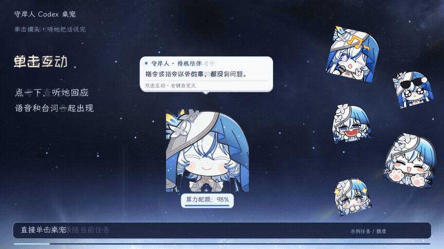

<div align="center">

# 守岸人 Codex 桌宠

**跟随 Codex 任务切换表情，支持自定义 GIF、语音和气泡台词。**

[下载 Windows 版](https://github.com/Doya16/shorekeeper-codex-pet/releases/latest) · [观看演示](https://github.com/Doya16/shorekeeper-codex-pet/releases/download/v0.8.1/shorekeeper-landscape.mp4) · [使用指南](docs/USAGE.md) · [问题反馈](https://github.com/Doya16/shorekeeper-codex-pet/issues)


</div>

适用于 **Windows 10/11 x64**。完整包附带 GB0227、GB0227 DLC、163 三套表情，共 83 个 GIF，以及 40 个音频文件、对应台词和字体。表情绑定、播放节奏、气泡、语音及外观已预设，解压后即可运行，无需安装 Python。

## 效果预览



[横屏视频：互动与完整设置演示](https://github.com/Doya16/shorekeeper-codex-pet/releases/download/v0.8.1/shorekeeper-landscape.mp4) · [竖屏视频](https://github.com/Doya16/shorekeeper-codex-pet/releases/download/v0.8.1/shorekeeper-portrait.mp4)

视频包含角色语音与守岸人角色曲 [《溯而复始》](https://www.bilibili.com/video/BV1jL4PeYEn8/)（鸣潮先约电台出品）。展示页采用鸣潮角色界面的动态星空背景，右侧表情循环播放。画面中的任务和额度为演示示例。

## 下载与使用

1. 在 Windows 上安装并登录 **Codex**。
2. 打开 [Releases](https://github.com/Doya16/shorekeeper-codex-pet/releases/latest)，下载 **Shorekeeper-Windows-v0.8.2.zip**。
3. 完整解压，运行 **Shorekeeper.exe**，保留同目录的其他文件夹。
4. 右键桌宠 → **自动跟随当前任务**；打开 **交互工作室**即可更换表情和语音。

声音默认开启，音量为 10%。在「外观、声音与迁移 → 声音」中调整或关闭。

## 功能

- **跟随任务**：思考、查阅、编辑、等待和完成时，切换到对应的表情。
- **鼠标互动**：单击摸头、双击、拖动、放下、递奶茶，各自设置回应。
- **自选素材**：每种交互单独选择 GIF 或图片；循环、速度、停留时间和下一状态均可调整。
- **语音与台词**：同一动作加入多条语音，逐条配对气泡文案，再随机抽取一组播放。
- **外观与配额**：实时缩放，调整字体和字号，桌宠下方显示算力配额。
- **保存与迁移**：将 GIF、声音、气泡、字体和全部配置一起打包，带到另一台电脑。

同一轮任务可以只播放一次思考开场语音。切换 GIF 后，当前语音会继续播放到结束。

气泡左右边界随桌宠大小同步，长台词自动换行，不截断行数或文字。选择 **自定义音频+字幕** 后，只显示抽中语音对应的文案，播完收起；不会再接着显示该动作的通用台词。附带配置中，已有语音与字幕配对的动作均已启用此模式。

## 自定义

右键桌宠 → **交互工作室**，先选左侧动作，再修改右侧设置。

| 想修改什么 | 设置入口 |
| --- | --- |
| 表情或图片 | GIF 素材 → 点击缩略图 |
| 添加自己的素材 | 导入图片；或打开素材目录 → 放入文件 → 刷新素材 |
| 循环、速度、播完停留、下一状态 | 播放与切换 |
| 气泡台词、字体、字号 | 气泡与字体 |
| 仅显示抽中语音的配对文案 | 气泡与字体 → 气泡内容 → 自定义音频+字幕 |
| 多条语音与逐条配对文案 | 语音与配对气泡 → 添加多个文件 → 选中一条编辑 |
| 任务开始只播一次语音 | 思考状态 → 自动播报频率 → 同一轮任务只播一次 |

| 自选表情 | 配对语音与气泡 |
| --- | --- |
|  |  |

支持 GIF、动画 WebP、PNG、JPG/JPEG、静态 WebP；语音支持 WAV、MP3、OGG、FLAC、M4A、AAC；字体支持 TTF、OTF、TTC。音频旁放置同名 UTF-8 TXT，可在导入时读取台词。不添加音频也能使用。


配对文案留空时，该条语音不显示气泡。使用默认内容或“使用我的台词”时，气泡只显示所选内容。已填写的其他台词会保留，切换模式后可以继续编辑。

**调整大小**：右键 → 调整大小，或将鼠标放在桌宠上按 **Ctrl + 滚轮**。详细格式限制和各项参数见 [使用指南](docs/USAGE.md)。

## 保存与迁移

修改会自动保存。手动保存或导出：**右键 → 外观、声音与迁移 → 保存与迁移**。

| 导出方式 | 包含内容 |
| --- | --- |
| JSON 快照 | 配置文字和选项 |
| 配置与素材 ZIP | GIF / 图片、音频、字体、气泡文案、全部配置及默认配置 |
| Windows 便携完整包 | 配置与素材，以及可运行程序 |

换电脑时，先安装并登录 Codex，再完整解压便携包并运行 **Shorekeeper.exe**。连接会重新自动检测，自定义内容保留，也可以继续导出。

## 常见问题

**表情没有跟随新任务？** 右键选择「自动跟随当前任务」。固定会话可在「外观、声音与迁移 → 连接 Codex」中修改。

**额度后面有 `*` 或显示 `--`？** `*` 表示缓存记录，`--` 表示暂无数据。右键点击「刷新额度」；悬停可查看完整窗口与重置时间。

**某些数值框是灰色的？** 当前模式不使用该设置，悬停查看提示。例如调整单次播放后的停留时间，需要选择适用的播放模式。

**遇到其他问题？** 到 [Issues](https://github.com/Doya16/shorekeeper-codex-pet/issues) 附上系统版本、操作步骤和报错截图。

## 素材来源与致谢

表情包素材来自 **[呜哇小站 · 表情包仓鼠库](https://emoji.wuwa.games/)**。

**表情包众筹 QQ 群：1079834905**

感谢所有为本项目使用的守岸人表情包参与众筹、出资支持的守岸人厨子们。

角色、图片与原版语音的权利归各自权利人所有。表情包仅供个人、非商业使用，请勿倒卖或用于付费分发。程序依赖及字体的许可不适用于角色素材；详见 [素材说明](assets/CREDITS.txt) 和 [第三方许可](THIRD_PARTY.txt)。

<details>
<summary>从源码运行</summary>

安装 Python 3.12，在项目目录执行：

```powershell
python -m venv .venv
.\.venv\Scripts\python.exe -m pip install -r requirements.txt
.\.venv\Scripts\python.exe pet.py
```

运行检查：`.\.venv\Scripts\python.exe -m unittest discover -s tests`。

</details>
