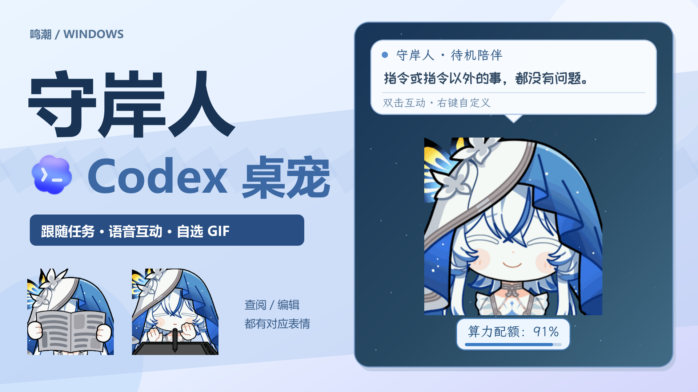
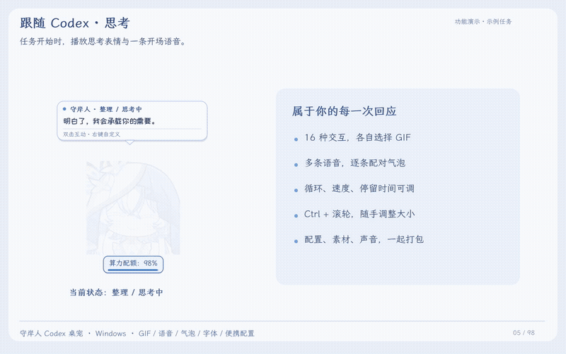
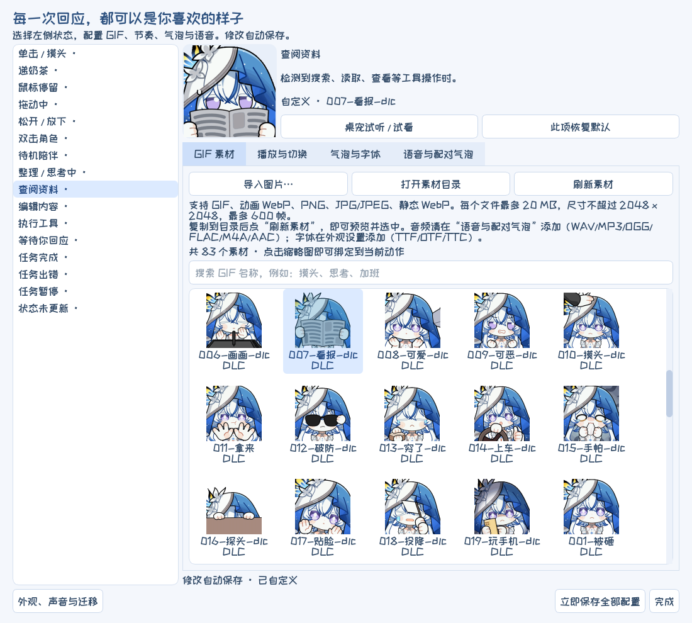
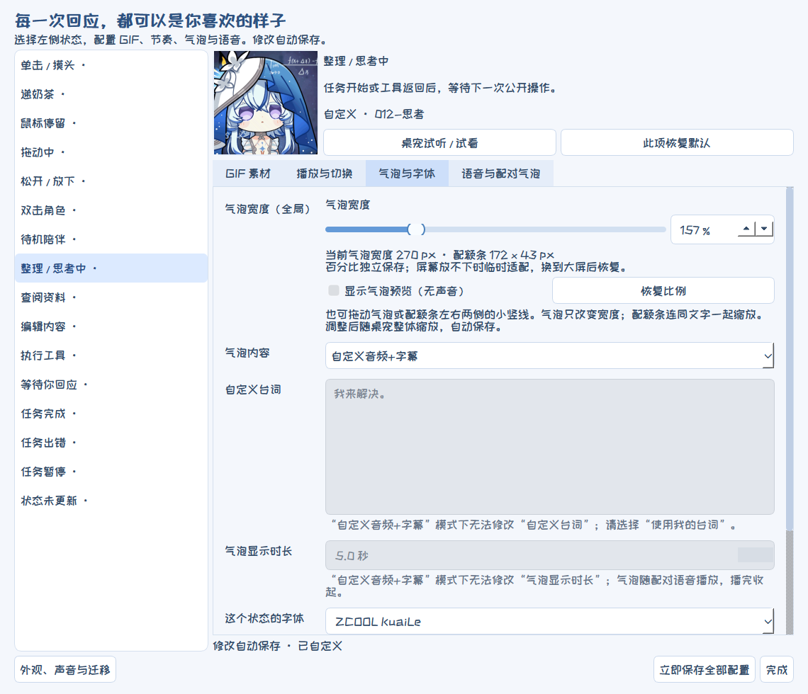
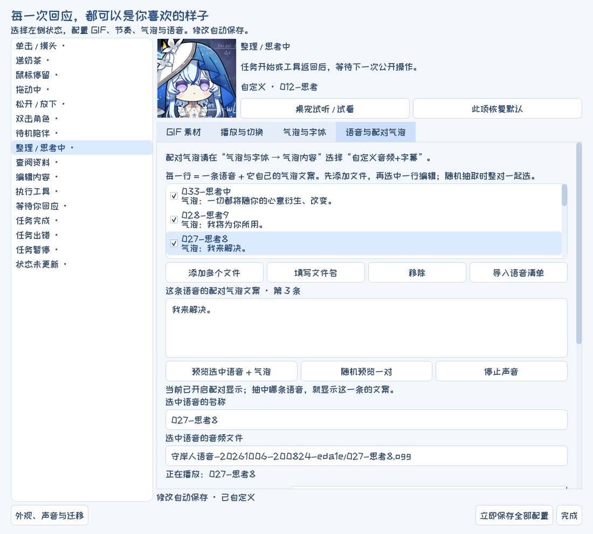
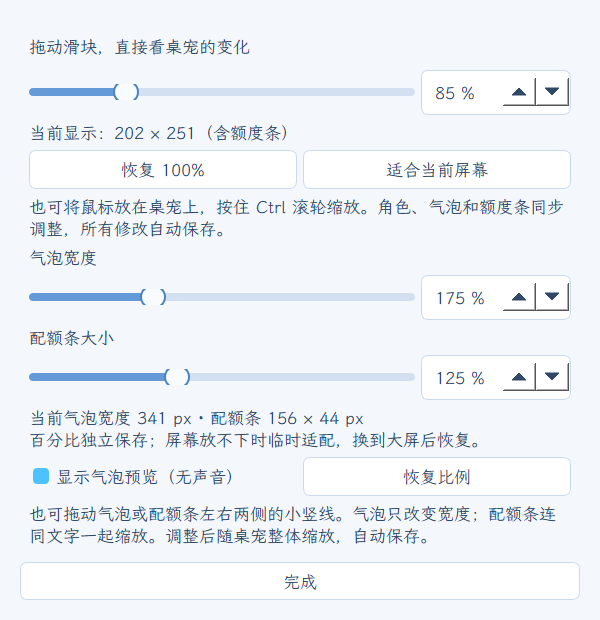
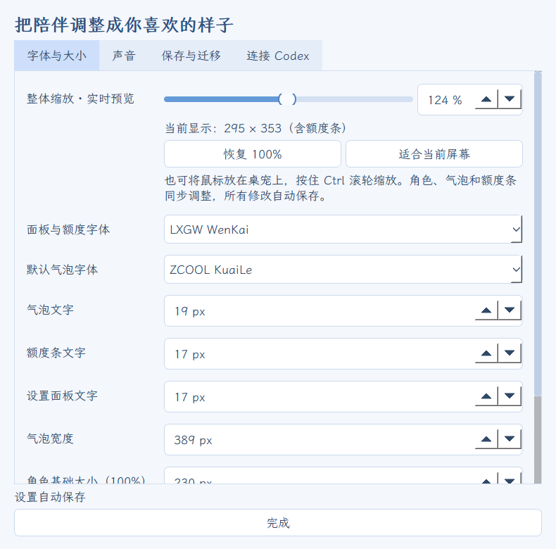
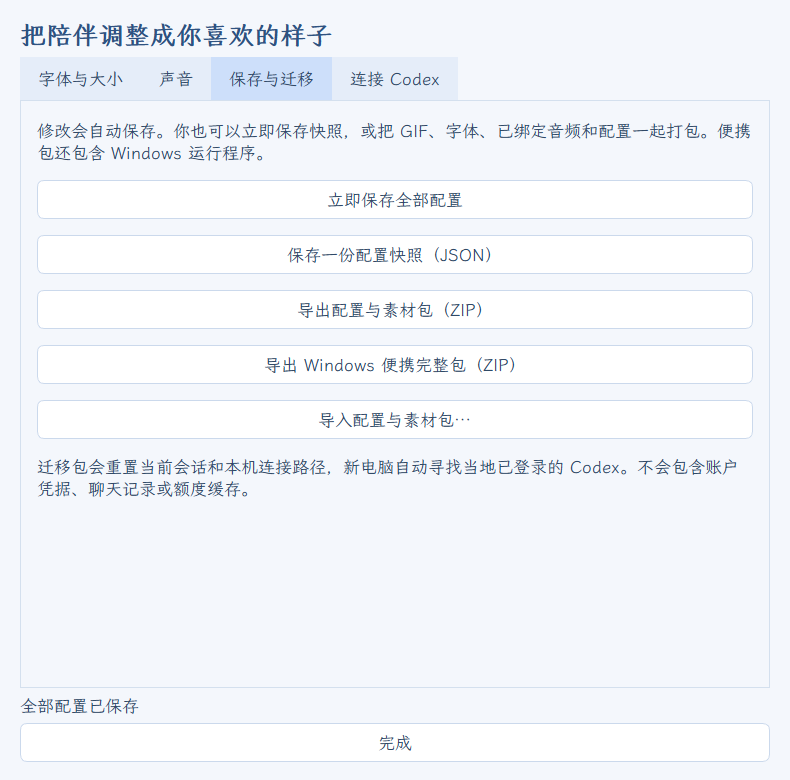

# 守岸人 Codex 桌宠 · Shorekeeper Codex Pet

把守岸人的 GIF、台词和声音带到桌面，陪你使用 Codex。

支持跟随思考、查阅、编辑和完成状态；单击、双击、拖动都有自己的回应。每种交互都能选择图片、播放节奏、语音和气泡文案。

**关键词：Codex 守岸人、Codex 桌宠、守岸人桌宠、Codex 插件、鸣潮守岸人、Shorekeeper desktop pet。**

[下载 Windows 完整包](https://github.com/Doya16/shorekeeper-codex-pet/releases/latest) · [观看横屏演示（含语音与 BGM）](https://github.com/Doya16/shorekeeper-codex-pet/releases/download/v0.8.1/shorekeeper-landscape.mp4) · [观看竖屏演示](https://github.com/Doya16/shorekeeper-codex-pet/releases/download/v0.8.1/shorekeeper-portrait.mp4)





> 展示使用示例任务和示例额度。视频包含思考、查阅、编辑、完成、拖动、放下、双击、摸头、语音试听、自选素材、缩放与保存迁移。

## 开始使用

1. 在 Windows 10/11 x64 上安装并登录 Codex。
2. 从 Releases 下载 **Shorekeeper-Windows-v0.8.3.zip**，完整解压到可写目录。
3. 双击 **Shorekeeper.exe**。保留同目录下的其他文件夹。
4. 右键桌宠，选择 **自动跟随当前任务**。
5. 右键 → **交互工作室**，开始选择你喜欢的表情和声音。

完整包已附带默认配置、83 个 GIF、40 个音频文件及内置字体，无需另装 Python。声音默认开启、音量 10%，可在“外观、声音与迁移 → 声音”调整或关闭。

## 可以做什么

| 功能 | 在哪里操作 |
| --- | --- |
| 思考、查阅、编辑、等待、完成时切换表情 | 右键 → 自动跟随当前任务；交互工作室中设置对应状态 |
| 单击摸头、双击回应、拖动、放下、递奶茶 | 直接与桌宠互动；每个动作可独立配置 |
| 每个状态选不同 GIF 或图片 | 交互工作室 → 左侧动作 → GIF 素材 |
| 添加自己的素材并预览 | GIF 素材 → 导入图片；或打开素材目录后放入文件并刷新 |
| 调整循环、速度、播完停留和下一状态 | 交互工作室 → 播放与切换 |
| 自定义气泡台词和状态字体 | 交互工作室 → 气泡与字体 |
| 同一动作随机抽取多条语音 | 交互工作室 → 语音与配对气泡 → 添加多个文件 |
| 每条语音配自己的气泡文案并试听 | 选中语音条目 → 编辑配对文案 → 预览选中语音 + 气泡 |
| 任务开始只说一次开场语音 | 思考状态 → 自动播报频率 → 同一轮任务只播一次 |
| 实时调整大小 | 右键 → 调整大小，或鼠标放在桌宠上按 Ctrl + 滚轮 |
| 调整全局字体、字号、音量 | 右键 → 外观、声音与迁移 |
| 查看算力配额 | 桌宠下方的小条；右键 → 刷新额度 |
| 保存、导入、导出全部配置和素材 | 外观、声音与迁移 → 保存与迁移 |

GIF 切换后，当前语音会继续说完；配对气泡也会保留到语音结束。双击只触发互动，不弹出面板。

## 添加 GIF、图片、声音和字体

在 **交互工作室 → GIF 素材** 点击 **打开素材目录**，把文件放进去，再点 **刷新素材**。也可以点 **导入图片…** 直接选择文件。点击缩略图即可绑定到左侧选中的动作，并在预览区查看。

| 材料 | 支持格式 | 添加入口 |
| --- | --- | --- |
| 动画 | GIF、动画 WebP | GIF 素材 → 导入图片 / 打开素材目录 |
| 静态图片 | PNG、JPG/JPEG、WebP | 同上 |
| 语音 | WAV、MP3、OGG、FLAC、M4A、AAC | 语音与配对气泡 → 添加多个文件 |
| 字体 | TTF、OTF、TTC | 外观、声音与迁移 → 字体与大小 → 添加本地字体 |
| 字幕 | 与音频同名的 UTF-8 TXT | 添加音频时一起读取；之后可逐条修改配对气泡 |

图片单个文件最多 20 MB、尺寸不超过 2048 × 2048、最多 600 帧。不可读取的文件会显示提示。新加入的图片、已绑定音频和字体会随迁移包一起保存。



## 调整播放、语音和气泡

- **播放一次**：完整播放一遍，再等待设定的停留时间。
- **循环播放**：可设置总时长；0 表示持续到下一次事件。
- **播放速度**：0.1–4 倍。
- **下一状态**：返回任务、保持当前状态，或切到指定动作。
- **气泡内容**：选择默认内容、使用我的台词、自定义音频+字幕，或关闭；各模式只显示所选来源的内容。
- **自定义音频+字幕**：先在“语音与配对气泡”添加音频，逐条填写文案，再到“气泡与字体 → 气泡内容”选择此模式。气泡随抽中的语音显示，播完收起；配对文案留空时不显示气泡，也不回退到通用台词。
- **气泡大小**：宽度可通过滑块、百分比输入或拖动左右边缘调整，允许宽于角色；长文案自动向下换行，不限制正文行数和文字长度，也不会因为文案变长而缩小字号。
- **气泡字体与时长**：可单独设置字体和字号。音频字幕模式的显示时长跟随语音，“自定义台词”和“气泡显示时长”会灰色锁定并显示说明；切换回适用模式即可调整。
- **语音候选**：逐条启用、移除、试听；每一条都有独立的配对气泡。
- **空音频**：不填写也能正常使用表情和气泡。
- **模式提示**：当前模式不适用的设置会变灰，并说明如何开启。

气泡可填写 `{state}`、`{quota}`、`{task}`、`{progress}`。点击“此项恢复默认”会恢复随项目附带的对应状态配置；其他状态不受影响。

默认配置中，已有语音与字幕配对的 11 个动作均使用“自定义音频+字幕”。原先填写的通用台词会保留，选择“使用我的台词”后可以继续编辑。





## 大小、配额与跟随会话

右键 → **调整大小…** 支持 50–200% 实时滑块、百分比输入、恢复 100% 和“适合当前屏幕”。大小自动保存；换到较小屏幕时会适配显示范围。

同一窗口中，**气泡宽度**和**配额条大小**可以独立调整：

1. 勾选 **显示气泡预览（无声音）**，即使当前没有台词，也能看到气泡。预览不会播放语音或更改状态绑定；关闭窗口后结束预览。
2. 用滑块或百分比输入调整；也可以直接拖动气泡左右两侧的小竖线改变宽度。长台词会重新换行，字号保持不变。
3. 拖动底部配额条两侧的小竖线，文字、边框和进度条一起放大或缩小。拖边不会触发摸头或移动桌宠。
4. 完成调整后，继续缩放桌宠，两者都会按已保存的比例同步缩放。点击 **恢复比例** 可将这两个比例恢复为 100%，不改变桌宠的整体缩放。

气泡宽度支持角色宽度的 **75%–400%**，配额条大小支持原大小的 **50%–250%**。这些比例也能在 **外观、声音与迁移 → 字体与大小** 调整；气泡宽度另可在 **交互工作室 → 气泡与字体** 调整，作用于所有状态。屏幕放不下时只临时适配，换到大屏后恢复保存的比例。



底部显示 **算力配额：98%** 这样的样式，实际数字以当前账户为准。悬停可看完整额度窗口及重置时间；数字后带 `*` 表示缓存记录，`--` 表示还没有额度数据。

若 GIF 没有跟随新任务，先右键选择 **自动跟随当前任务**。也可在 **外观、声音与迁移 → 连接 Codex** 中选择固定会话。安静陪伴不会关闭任务动画。



## 保存配置，带到新电脑

所有修改都会自动保存，也可以点击 **立即保存全部配置**。

- **JSON 快照**：保存配置文字和选项。
- **配置与素材 ZIP**：保存配置、GIF / 图片、气泡文案、字体、音频及默认配置。
- **Windows 便携完整包**：额外包含运行程序，适合直接带到新电脑。

新电脑先安装并登录 Codex，再完整解压便携包并运行 **Shorekeeper.exe**。连接路径和会话会重新自动检测；自定义内容保留。以后仍可从新电脑继续导出。



## 常用操作

- **左键单击**：摸头。
- **左键按住并移动**：拖动；松开时触发放下动作。
- **双击**：播放双击互动。
- **右键**：打开交互工作室、调整大小、刷新额度和其他设置。
- **Ctrl + 滚轮**：缩放，每格 5%。
- **系统托盘图标**：显示或隐藏桌宠。

## 表情包素材来源与致谢

表情包素材来自 [呜哇小站 · 表情包仓鼠库](https://emoji.wuwa.games/)。

**表情包众筹 QQ 群：1079834905**

感谢所有为本项目使用的守岸人表情包参与众筹、出资支持的守岸人厨子们。谢谢你们让这些可爱的表情与大家见面，也让守岸人能够以更多模样陪在桌面上。

角色、表情包图片与原版语音的权利归各自权利人所有。表情包仅供个人、非商业使用，请勿倒卖或用于付费分发；程序及字体的许可不适用于角色素材。

## 从源码运行

安装 Python 3.12，在项目目录执行：

```powershell
python -m venv .venv
.\.venv\Scripts\python.exe -m pip install -r requirements.txt
.\.venv\Scripts\python.exe pet.py
```

运行检查：`.\.venv\Scripts\python.exe -m unittest discover -s tests`。

字体及随包组件许可见 [THIRD_PARTY.txt](../THIRD_PARTY.txt) 和 `licenses`、`fonts` 目录。角色图片与语音素材不适用程序依赖的许可。
